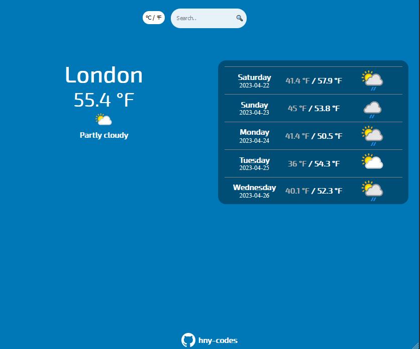
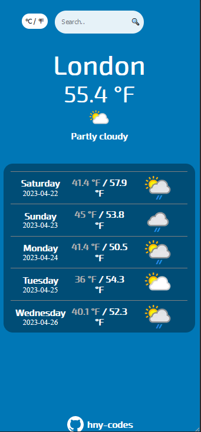

# Simple Weather App

A simple weather application created with React (Javascript) and scaffolded with Vite, using the [Weather API](https://www.weatherapi.com/).

## Built with
- Javascript (React)
- CSS
- Mobile-first workflow
- Vite

## Local Deployment
1. Sign up for your own API key at [Weather API](https://www.weatherapi.com/)
2. Create a `.env` file  at project root and add `VITE_API_KEY = {your key here}`
3. `npm install`
4. `npm run dev` to launch local development environment
5. `npm run build` to build the project

Many thanks for:
- [Weather API's interactive API explorer](https://www.weatherapi.com/api-explorer.aspx)
- Loader by [CSS Loader library](https://cssloaders.github.io/)